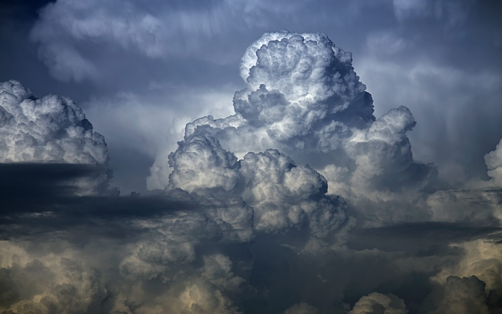
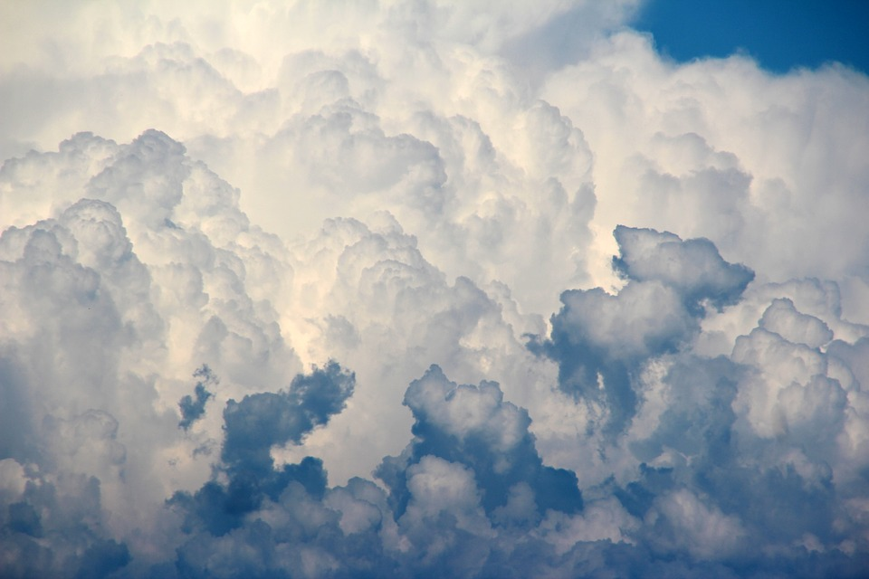
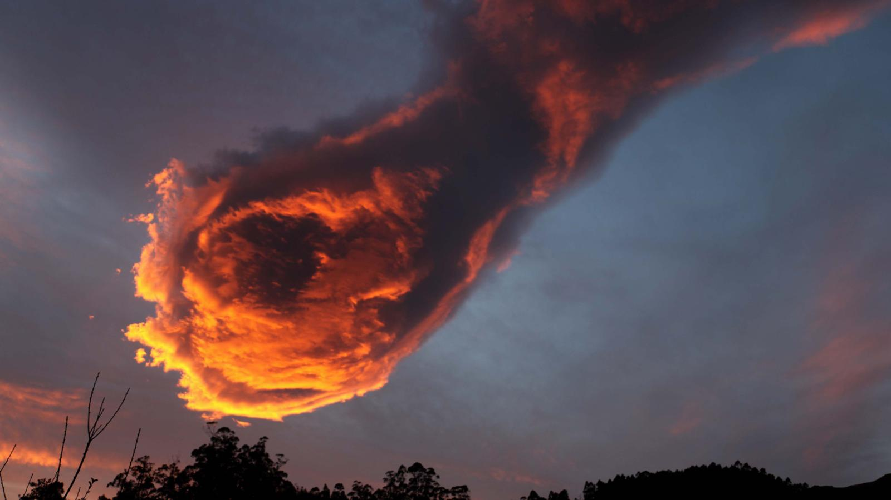

# Final Project: Volumetric Clouds/Fire

## Overview & Inspiration
The goal of the project is to create an environmental setpiece involving realistic and aesthetic clouds for which
I hope to provide a gui so that the user can navigate around the setpiece and fly through the clouds.

The paper I mainly referenced is [Efficient Algorithms for Real-Time GPU Volumetric Cloud Rendering with Enhanced Geometry](https://www.mdpi.com/2073-8994/10/4/125/html). The paper was published relatively recently and surveys recent techniques which made believe it'd give well-fleshed advice and methodologies. Only flat images of the outputs of the paper are available so my end result can't be well gauged but I plan to improve upon the results the method in the paper gives me.

I wanted to work with gas/particles/realistic rendering (and debated between options of creating a setpiece with a burning Hollywood sign, colorful explosive gas, and clouds). Some inspirations and aims are shown below:

## Progress Update

## Methodology
* Water Vapour Emulation
* Cloud Tracing
* The No Duplicate Tracing Algorithm
* Scene Delimitation
* Lighting and Shading
* Cloud Shape Improvement

## Reference
