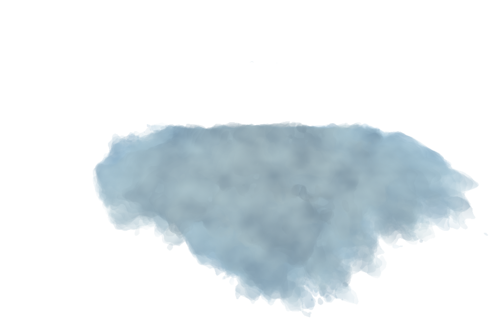

# Final Project: Volumetric Clouds
Live demo can be found here: https://hjchun96.github.io/566-final-project/

## Overview & Inspiration
The goal of the project is to create an environmental setpiece involving realistic and aesthetic clouds for which I hope to provide a gui so that the user can navigate around the setpiece and fly through the clouds.

There are multiple types of clouds and most procedurally generated clouds are purely noised based without using sdfs, which usually results in Stratiform clouds. They are able to achieve such shapes by overlaying worley noise with FBM to create roughly cloud-like shapes, but it is harder to clearly define shapes in this way. I aim to produce cumulus clouds by basing the cloud shapes on ellipsoids, which can be characterized by more defined edges and harsher contrast/shading. Some inspirations being images shown below:

## Progress Review
Rough rendering with FBM noise offsets.

Improved lighting

Polished Environment and Lighting

## Methodology
* Water Vapour Emulation
  - fbm for density

* Cloud Tracing
  - Raymarching with set steps. Way for optimization would be to reduce step size once the ray enters the cloud to provide greater detail.

* The No Duplicate Tracing Algorithm

* Scene Delimitation

* Lighting and Shading
  - Lambert-Beer's Law: gives transparency of the volume between camera and the position. This is then used to calcualte the opacity of the cloud, which is then used to blend the sky and the color of the cloud.
  - Green-Heyney

* Cloud Shape Improvement
  - Metaballs

## Furture Work
* Texture pre-loading
* CPU Side calculations

## Reference
The paper I mainly referenced is [Efficient Algorithms for Real-Time GPU Volumetric Cloud Rendering with Enhanced Geometry](https://www.mdpi.com/2073-8994/10/4/125/html). The paper was published relatively recently and surveys recent techniques which made believe it'd give well-fleshed advice and methodologies. Only flat images of the outputs of the paper are available so my end result can't be well gauged but I plan to improve upon the results the method in the paper gives me.
