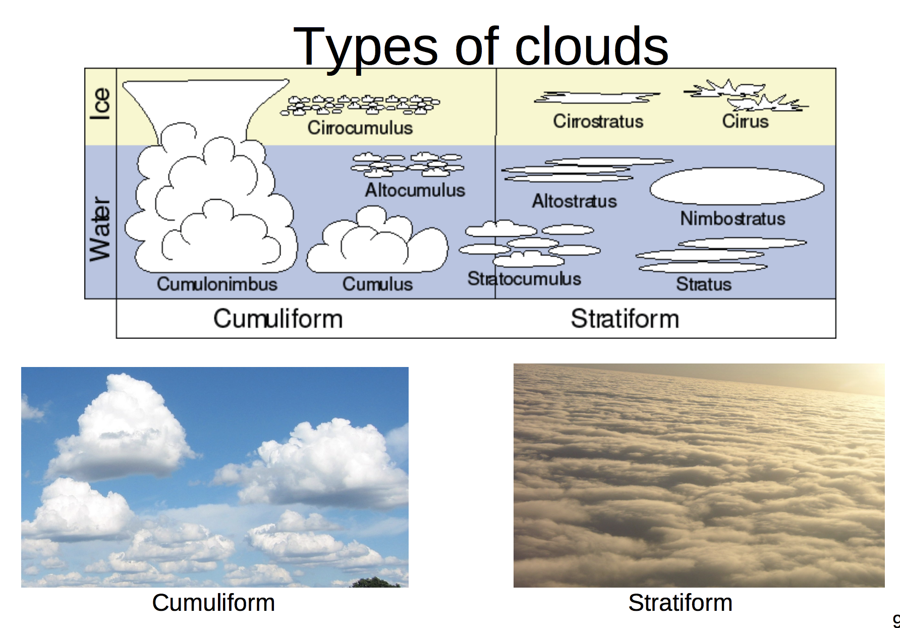
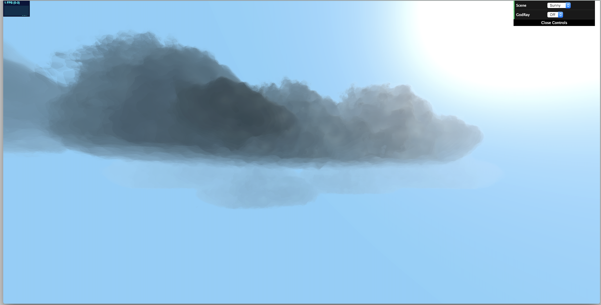
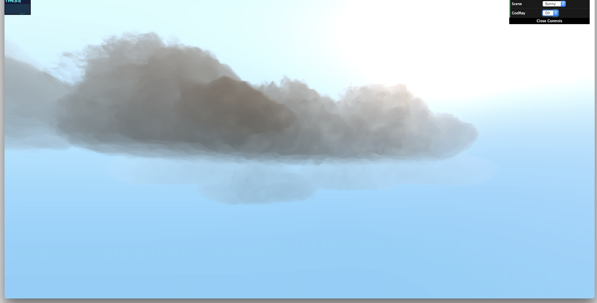
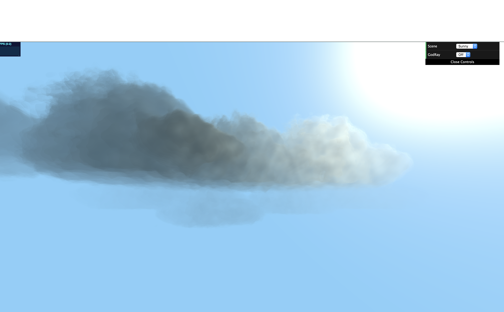

# Final Project: Volumetric Clouds
Live demo can be found here: https://hjchun96.github.io/566-final-project/

## Inspiration
The goal of the project is to create an environmental setpiece involving realistic and aesthetic clouds for which I hope to provide a gui so that the user can navigate around the setpiece and fly through the clouds.

There are multiple types of clouds and most procedurally generated clouds are purely noised based without using sdfs, which usually results in Stratiform clouds. They are able to achieve such shapes by overlaying worley noise with FBM to create roughly cloud-like shapes, but it is harder to clearly define shapes in this way. I aim to produce cumulus clouds by basing the cloud shapes on ellipsoids, which can be characterized by more defined edges and harsher contrast/shading. Some inspirations being images shown below:

## Overview & Features
I created two environmental scenes. One is a day scene with a god ray, bright skylight, and white clouds, created to best show the realistic aspect of the cloud during a scene the viewer would normally expect. The other is after the sun is set, which was created to mimic my inspirational image with harsher shadows and blue hue throughout.

For the day scene, I added god rays as a post-processing effect - given the scene it seemed like an appropriate feature to have.

Some generated images are shown below:

The main challenge was the fact that there is no set, optimal way of rendering. Many papers followed different methodologies or approached volumetric integration of light very differently, so I had to piece together a lot of different ways and include hacks to make sure my scenes looked realistic. Furthermore, a lot of examples were based purely on noise functions with no set shapes which made it more difficult for me to find good examples to rely on.

## Progress Review
Cloud color controlled by density only

Density accounted into transmittance but no lighting effects applied

Scattering (Henyey Greenstein, Forward Scattering)

Scattering + Absorption (Beer Law)

Scattering + Absorption + Powder Law

All Lighting with backscattering

All Lighting + God Ray

## Methodology
* Water Vapor
  - fbm noise was used to calculate the density of a point on a cloud

* Cloud Tracing
  - Raymarching was done with set steps with set steps (Way for optimization would be to reduce step size once the ray enters the cloud to provide greater detail)

* Lighting and Shading
  - Volumetric Integration lies at the heart of lighting, which was one of the hardest and most interesting part of the project.

  - Lambert-Beer's Law gives transparency of the volume between camera and the position. This is then used to calculate the opacity of the cloud, which is then used to blend the sky and the color of the cloud.

  - Scattering done using phase function defined by Green-Henyey

  - In-Scattering/Powder Effect

  - Background shading and forward/background blending

* God Rays
  - Added god rays as a post-processing effect to decorate the scene.

## Furture Work
* Optimization: Texture pre-loading, CPU Side calculations
* Cloud Shape Improvement- Metaballs?
* Dark shadow fixes

## Reference
* Paper I initially referenced/presented [Efficient Algorithms for Real-Time GPU Volumetric Cloud Rendering with Enhanced Geometry](https://www.mdpi.com/2073-8994/10/4/125/html). The paper was published relatively recently and surveys recent techniques which made believe it'd give well-fleshed advice and methodologies. However, its notations were inconsistent and rather difficult to understand so I also looked at

* https://is.muni.cz/th/396277/fi_m/thesis.pdf

* http://advances.realtimerendering.com/s2015/The%20Real-time%20Volumetric%20Cloudscapes%20of%20Horizon%20-%20Zero%20Dawn%20-%20ARTR.pdf

* https://www.guerrilla-games.com/read/nubis-authoring-real-time-volumetric-cloudscapes-with-the-decima-engine
